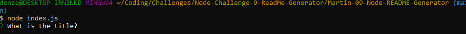

# Martin-09-Node-README-Generator

## Description
This project is made as a node generator that makes a professional README file. This acts a a quick and easy way to make a proper README file for other projects you want to apply this too. This project allowed me to apply what I've learned about Node.js this past week.

## Table of Contents 
- [Description](#description)
- [Installation](#installation)
- [Usage](#usage)
- [Credits](#credits)
- [License](#license)
- [Tests](#tests)
- [Questions](#questions)

## Installation

To run the project, you must first install "inquirer. This can be done by entering "npm i inquirer@8.2.4" into GitBash in the project file. Then the application will be invoked by using the command "node index.js".

## Usage
     
<a href="https://drive.google.com/file/d/1sZj1B3Tzki99mQDSTIQ0r7CXi53smvuG/view"> Link to video tutorial of application"</a>

## Credits

Starter Code:
<a href="https://github.com/coding-boot-camp/potential-enigma">Starter Code Source</a>

## License

None

## Badges

    
## Questions

For any additional questions, reach me at <a href="martinapopot@gmail.com">My email</a> or <a href="https://github.com/mardyyy">My github</a>.

    